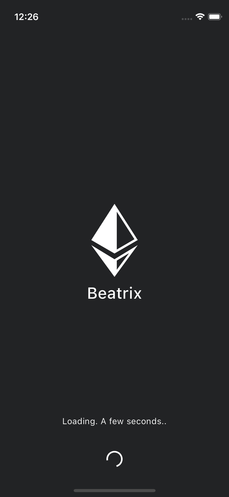
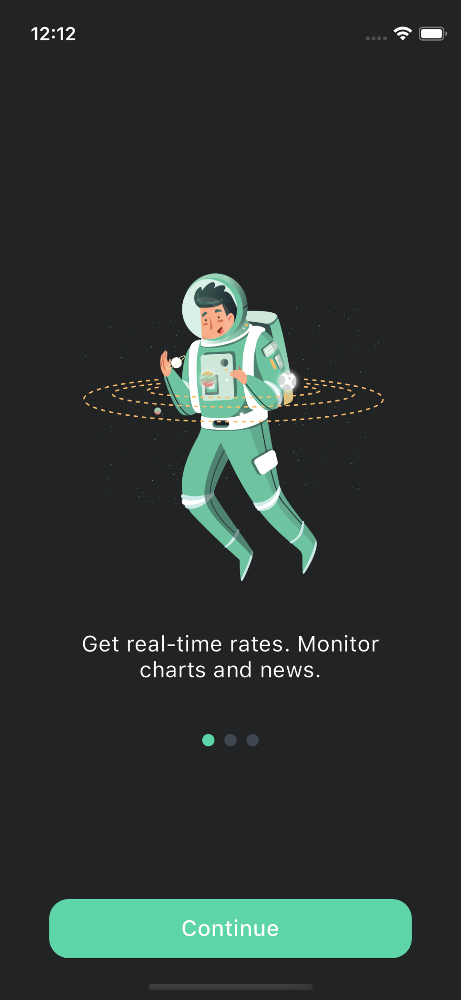
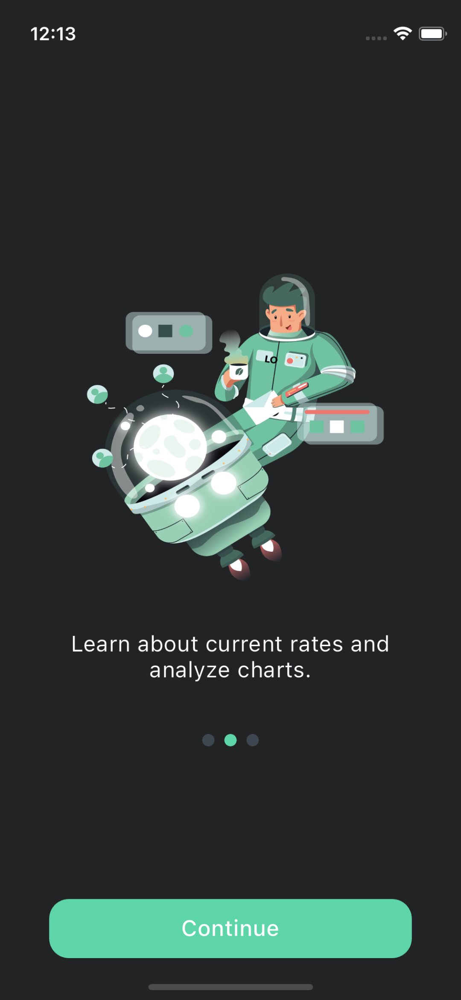
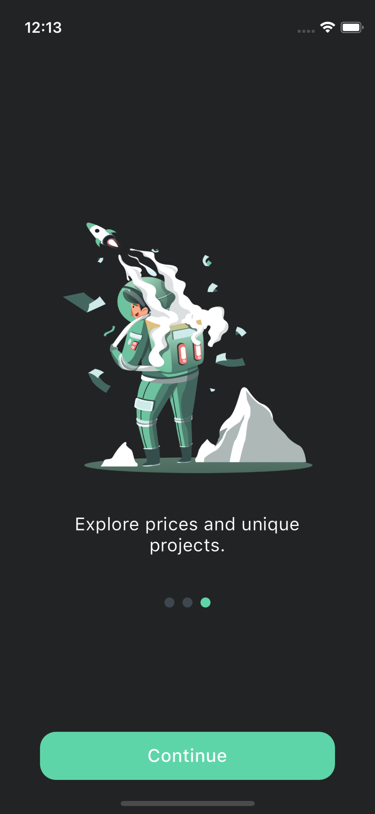
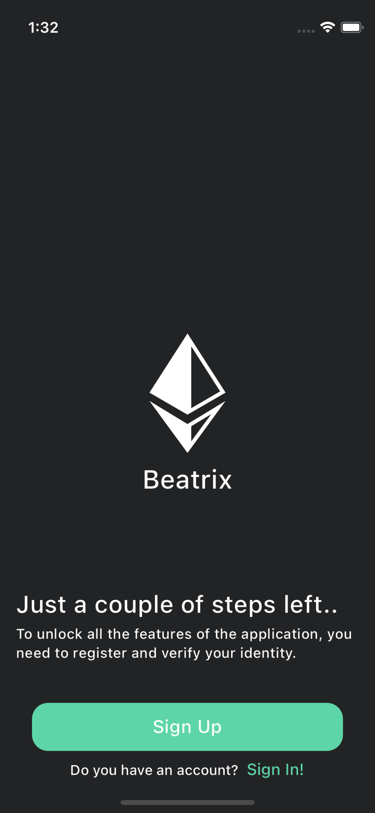
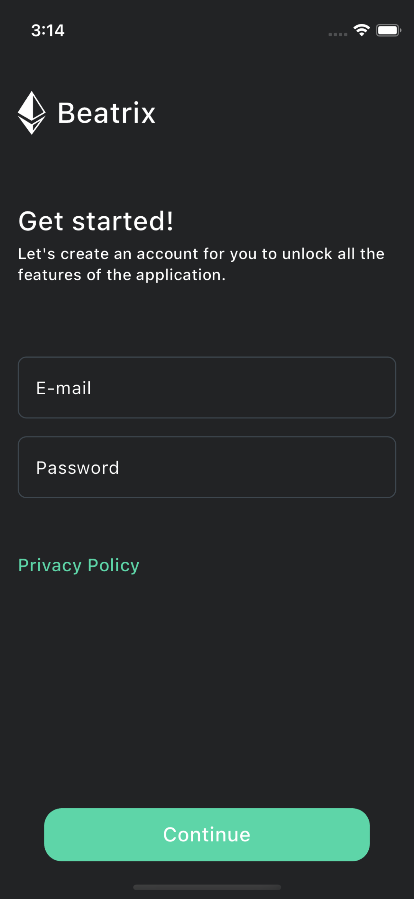
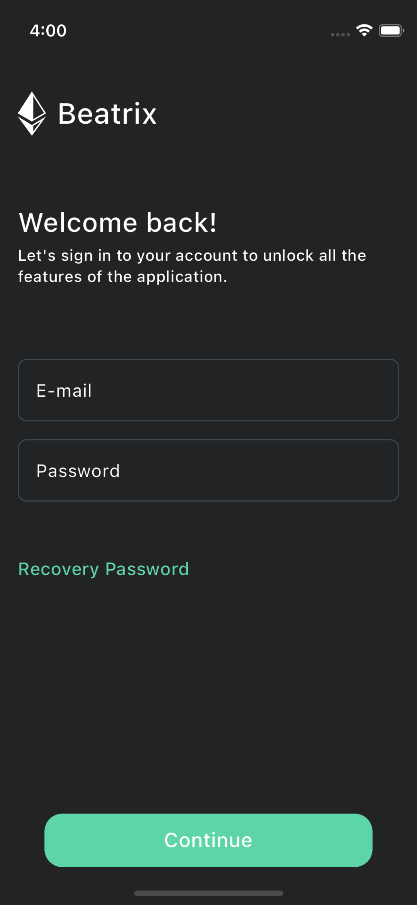
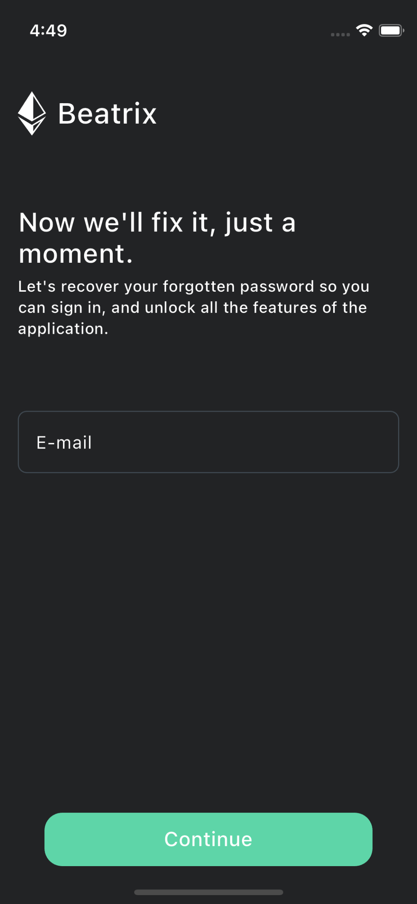

## Beatrix.

#### Description.
The project was developed for educational purposes, using Dart programming language and Flutter framework. The main task was to acquire skills and learn the process of building a user interface.

Perhaps in the future the possibility of integrating the server side will be considered. Thus, the project provides not only experience in user interface creation, but can also become a platform for mastering aspects in northern development and security.

#### Presentation.

<table>
  <tr>
    <td></td>
    <td>
    <td>
    <td>
  </tr>
</table>

<table>
  <tr>
    <td></td>
    <td></td>
    <td></td>
  </tr>
</table>

<table>
  <tr>
    <td></td>
    <td></td>
    <td></td>
  </tr>
</table>

<table>
  <tr>
    <td></td>
    <td></td>
    <td></td>
  </tr>
</table>
